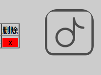
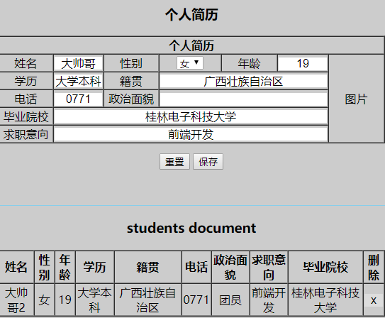

# mongoose
## 安装mongoDB
* `sudo apt-get install mongodb`

## 部分处理
* 添加favicon.ico:` <link rel="shortcut icon" type="image/x-icon" href="/static/images/favicon.ico" />`
* 添加防注入

    ```js 
        let reg = /<|>|%|\\|"|=|'|{|}|!|\?|\(|\)|\*/;
        for (let i in obj) {
            if (obj[i] == "") {
                delete obj[i]
            }
            else {
                obj[i] = obj[i].trim()
                if (reg.test(obj[i])) {
                    alert("数据类型错误: " + '"' + obj[i].match(reg) + '"')
                    console.log(obj[i].match(reg))
                    return
                }
                if (/\s{3}/.test(obj[i])) {
                    alert("空格太多了: " + obj[i])
                    return
                }
            }
        }
    ```
* 添加上传图片
    * 删除暂存的图片
        ```js
        /**
        * (无法删除文件夹)
        * @param {string} str 输入一个文件夹地址删除里面的文件
        */
        function dlete_files(str) {
            fs.readdirSync(str).forEach(function (el, index) {
                if (fs.existsSync(str + "/" + el)) {
                    if (el.indexOf(".") != -1)
                        fs.unlinkSync(str + "/" + el)
                }
            })
        }
        ```
    *  存图片防止目录不存在
        ```js
        /**
        * 递归创建文件夹
        * @param {string} str 输入一个有关路径的字符串
        */
        function new_dir(str) {
            let array = str.replace(/^\/*|\/*$/g, "").split('/')
            let dir = __dirname
            for (let i = 0; i < array.length; i++) {
                dir += "/" + array[i]
                if (fs.existsSync(dir)) {
                    continue
                } else {
                    fs.mkdirSync(dir)
                }
            }
        }
        ```
* ~~问题:删除所有记录后再添加图片显示错误~~

* 添加显示头像
  
 > 
* 添加加载效果
  
 > 
* 添加异步处理ajax请求
    ```js
    /**
   * 
   * @param {string} url 请求地址
   * @param {string} type 请求方式
   * @param {object} data post 发送数据
   * @param {Boolean} processData 发送文件选false,默认true
   * @param {Boolean} contentType 发送文件选false,默认true
   */
    async function ajax(url, type, data, processData, contentType) {
        return await new Promise((resolve, reject) => {
            $.ajax(method).done(
                function (res) {
                    student_list = res.res
                    console.log(res)
                    resolve(res)
                }
            )
        })
    }
    ```


## 数据库基本操作
[实例地址](http:182.254.195.126:8989)
[官方文档参考](http://www.mongoosejs.net/docs/connections.html)

[内嵌数组操作](https://blog.csdn.net/chaoyangsun/article/details/79829368)

配置文件地址: `/etc/mongodb.conf`

数据库重启: `/etc/init.d/mongodb restart`

关闭27017防火墙端口: `iptables -A INPUT -p tcp -m state --state NEW -m tcp --dport 27017 -j ACCEPT`

### 创建管理员账户
* 先进入admin数据库 : `use admin`
* 创建用户: `db.createUser({user:"用户名",pwd:"密码",roles:[{ role: "root", db: "admin" }]})` 
* 修改配置文件,需要用户验证登录: `vim /etc/mongodb.conf` 将 `auth = true` 注释去掉
* 重启数据库 `/etc/init.d/mongodb restart`
* 重新进入数据库,现在是没有任何权限的,先进入admin数据库.
*  `use admin`
*  输入管理员账户密码: `db.auth("用户名","密码")`.
*  好了可以开始你的表演了...
### 添加用户
| 命令                                                                                        |       作用       |
| :------------------------------------------------------------------------------------------ | :--------------: |
| `use db`                                                                                    | 先进入对应数据库 |
| `db.createUser({user:"用户名",pwd:"密码",roles:[{ role: "readWrite", db: "所属数据库" }]})` |     创建用户     |

* 先进入数据库然后再创建用户及其权限

### 删除用户
进入对应数据库 `show users` 可以显示当前数据库所有用户及其权限

|            命令            |                使用                |
| :------------------------: | :--------------------------------: |
|        `show users`        | 可以显示当前数据库所有用户及其权限 |
| `db.dropUser(<user_name>)` |    删除某个用户，接受字符串参数    |
|     `db.dropAllUser()`     |        删除当前库的所有用户        |


### 密码连接
* 带密码的连接数据库
    ```js
        // Build the connection string
        var dbURI = 'mongodb://localhost/students';
        const options = {
            useNewUrlParser: true //使用客户端
            , useUnifiedTopology: true //报错
            , authSource: "admin",
            user: "togoc",
            pass: "tgc.123"
        }

        // Create the database connection
        mongoose.connect(dbURI, options);
    ```

### 远程连接mongodb

* 主要是一些设置问题,修改mongodb配置文件
    ```
    #bind_ip = 127.0.0.1
    bind_ip=0.0.0.0
    port = 27017
    ```
* 如果再不行的话修改下服务器的端口安全策略,添加27017端口
<hr>
  
### 数据库备份与恢复
#### 备份
+ `mongodump -h <hostname><:port> -d dbname -o dbdirectory`
  + -h ：
    + MongDB所在服务器地址，例如：127.0.0.1，当然也可以指定端口号：127.0.0.1:27017
  + -d :
    + 需要备份的数据库实例，例如：test
  + -o ：
    + 备份的数据存放位置,为空时在当前目录(文件名)
+ `mongodump` 命令不加任何参数, 备份所有localhost:27017数据库在当前目录


#### 恢复

+ `mongorestore -h <hostname><:port> -d dbname <path>`
  + -h ：
    + MongDB所在服务器地址，例如：127.0.0.1，当然也可以指定端口号：127.0.0.1:27017
  + -d,-db :
    + 实例恢复后的名字,可以与备份的不同
  + --drop :
    + 恢复的时候, 先删除当前数据(如果当前有相同数据库名), 然后恢复备份的数据。
  + `<path>` : 最后的一个参数,设置备份数据所在位置.
  + 例子 : `mongorestore -h localhost:27017 -d  students  ./students`
  + 加密数据库恢复例子: `mongorestore -u <username> -p <password> -h localhost:27017 -d article ./article --authenticationDatabase admin`

### 备份和恢复单个集合
#### 备份
+ `mongoexport -h localhost:27017 -d www -c mallshop_swiperlists -o  swiperlist`

#### 恢复
+ `mongoimport -u xxx -p xxx  --host xxx --port xxx --db xx --collection xxx --file xxx --authenticationDatabase admin`


<br>
<br>
<br>
<hr>



